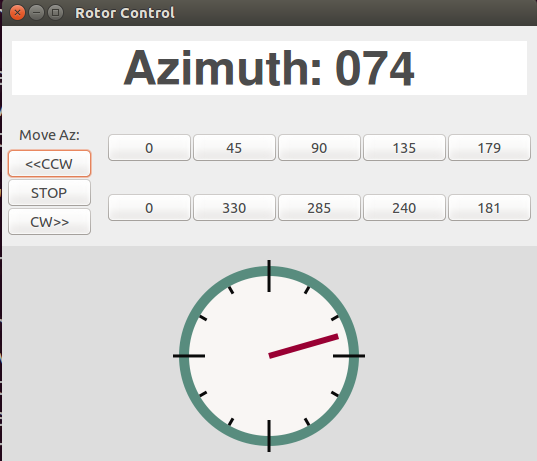

# grotor
*GUI for Hamlib rotor control (rotctl)*

---
## Description
grotor is a graphical user interface for the hamlib antenna rotor control program [rotctl](http://hamlib.sourceforge.net/manuals/hamlib.html#rotctl). It provides display of the current azimuth (text and graphic), and provides buttons for controlling the antenna rotor. 

This a beta release of grotor, so the options and configration settings are limited. Future releases will provide the ability to configure grotor/rotctl, as well as adding elevation display and control.

## Commands
setup: grotor requires hamlib to be installed, and rotctld to be running on an antenna rotor controller. For example, starting up a rotctl daemon for a Yaesu G232B rotor on ttyUSB1 : `rotctld -m 603 -r /dev/ttyUSB1 -s 9600`.   grotor uses the "-m 2" NET interface to connect to this daemon. 

to run: `grotor [-v] [-s step] [-d size]  `
### grotor options
 -v verbose debug logging to console screen
 -s azbutton\_step default=45 degress, step size when creating az buttons
 -d azdisplay\_size default = 220, height/width in pixels of the az graphic display

## Installation

copy grotor program to suitable PATH directory

## Requirements
+ python 2.7+
+ pygtk 2.0
+ other python libraries: subprocess, math, logging, getopt
+ hamlib 2.0+ (requires rotctl)

grotor is developed and tested  on Linux (Ubuntu 15.10).  Modifications for other OS environments have not been done, but it should be able to work on Windows/Mac with minor modifications.
## License
grotor is licensed under MIT License.

